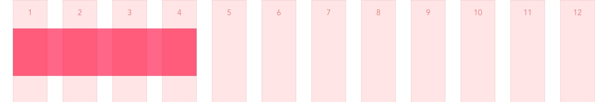
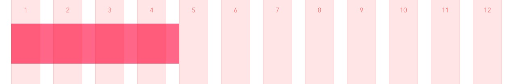
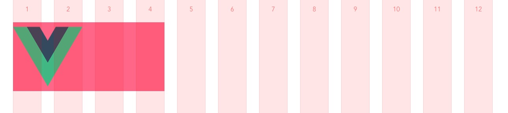
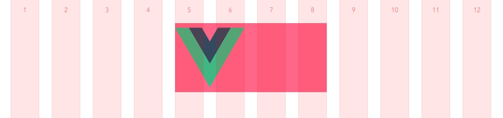
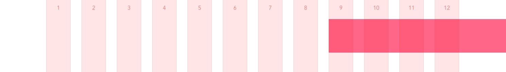

# 🍳 Griddle - Cook up something delicious.

Griddle is a visual grid overlay and Sass mixin system to help with your front-end development.

The goal of the system is to assist front-end engineers in executing a 1:1 implementation of referenced designs. This is done through a visual grid overlay that is toggleable in the browser and an accompanying set of `.scss` mixins and functions that place items precisely on the grid.

## Why does Griddle exist?
[Details Matter: Add a Visual Grid System to your Front-end Development Process](https://www.wearebraid.com/articles/add-visual-grid)

## Who is Griddle for?
If you prefer for all of your layout work to occur inside of your project styles then Griddle is for you. Griddle is for front-end engineers who prefer to do their layout work via "rules inside of stylesheets" rather than "classes inside of HTML templates". If you're cozy with Bootstrap's class system or a utility framework such as Tailwind — then this approach will take some adjustment to your mental model.

## Real projects made with Griddle
use `control + shift + L` to show the Griddle overlay.

- [Braid](https://www.wearebraid.com) - Digital Agency, authors of Griddle.
- [Outdoor Dreams](https://www.outdoordreamsva.com) - Bespoke outdoor rooms.
- [Cosaic](https://cosaic.io) - Industry-leading financial software.
- [Gardenary](https://www.gardenary.com) - Garden Coaching and education.
- [Sidecar](https://sidecar.work) - On-demand project and office adminstration.

## Installation

### Vue
First, install the Vue plugin to access the `<Griddle>` component.

```javascript
/* in your project setup file */
import Vue from 'vue'
import Griddle from '@braid/griddle/vue'

Vue.use(Griddle)
```

and place the available `<Griddle />` component in your project root layout

```html
<!-- in your project root layout -->
<template>
  ...
  <Griddle />
  <!--
  the Griddle component has props for column-border and
  column-numbers which both default to true
  -->
</template>
```

Second, you need to add the Griddle `.scss` mixins to your project. The exact method to do this may differ depending on your specific build process. Here is an example using a `vue.config.js` from a Vue CLI 3 project.

```js
/* in vue.config.js */
module.exports = {
  css: {
    loaderOptions: {
      sass: {
        // An overrides file should be included in your build process
        // before griddle.scss if you wish to override default settings
        data: `
          @import "@/assets/griddle-overrides.scss";
          @import "@braid/griddle/assets/scss/griddle.scss";
        `
      }
    }
  }
}
```

### Other Frameworks?
Griddle is 99% the `.scss` mixins represented in this repo. Pull Requests are welcome for other frameworks if you would like to include Griddle in your specific workflow.

## Customization

Griddle is intended to match your design file’s grid settings as closely as possible. Use the available column and gutter sizes along with the column count from your design program to set up your project. Here are the default settings that can be overridden. Feel free to copy them to your own overrides file as a starting point.

```scss
$g-max-column-width: 4.5em !default; // 72px
$g-max-gutter-width: 2em !default; // 32px
$g-column-count: 12 !default;
$g-column-color: red !default; // fill color will be used at 10% opacity

$g-user-breakpoints:
  // each breakpoint consists of 3 items:
  // 1.) name,
  // 2.) breakpoint width
  // 3.) inset from edge of screen
  'base' 0em 1em, // the base breakpoint is required
  'xs' 23.5em 1em, // 376px
  's' 36em 1.5em, // 576px
  'm' 48em 2em, // 768px
  'l' 64em 3em, // 1024px
  'xl' 86.5em auto, // 1384px
  'xxl' 100em auto // 1600px
!default;
```

## Usage

### In Browser
Press `control + shift + L` (think "Layout") to toggle the visual grid overlay. At 100% zoom your grid in the browser should perfectly match your grid in you target design file.

### In Code

### `container()`
a `container()` mixin sets up the responsive styles needed to create a grid container element. This element should consist of 100% of the available viewport width and must surround any `span()` mixins in order for them to be aligned to the grid.

```html
<!-- example Vue component -->
<template>
  <div class="container">
    ...
  </div>
</template>

<style lang="scss" scoped>
.container {
  @include container();
}
</style>
```

### `span()`
a `span()` function calculates a percentage width based on its given arguments. The `span()` function always returns a `%` value. The `span()` function takes 3 arguments which will each be explained in further detail:

- `columns`: (required) The number of columns you wish to span, including interior gutters.
- `extra_gutters`: (optional) The number of extra gutters you wish to span.
- `context`: (optional) The context for width calculations. Defaults to 100% which is the full grid width.

The simplest usage of the `span()` function is to specify only a number of `columns` to be spanned.
```scss
.my-element {
  width: span(4); // 31.57895% assuming a 12-column grid
}
```



If you need to span across any `extra_gutters` you can pass those as a 2nd argument to the function.
```scss
.my-element {
  width: span(4, 1); // 34.21053%; assuming a 12-column grid
}
```



Lastly, you may be trying to style an element that's nested inside of a parent element that already has `span()` styles applied to it. In this case, if you provide the parent `context` as a 3rd argument the `span()` function will return _root_ `column` and `gutter` values
```scss
.my-element {
  width: span(4); // 31.57895% assuming a 12-column grid

  img {
    width: span(2, 0, span(4)) // 45.83333% assuming a 12-column grid
    // PRO TIP!
    // the second argument in span() is flexible. If you don’t need any
    // extra gutters you can pass a span() context as the 2nd argument
    // and it will be resolved.
    // "span(2, 0, span(4))" is the same as "span(2, span(4))"
  }
}
```


Do you need to push or pull an element by a number of columns? Since the `span()` function always returns a percent you can use it in other properties all well. To push and pull I recommend `left-margin`.

```scss
.my-element {
  width: span(4); // 31.57895% assuming a 12-column grid
  margin-left: span(4, 1); // 34.21053% assuming a 12-column grid

  img {
    width: span(2, 0, span(4)) // 45.83333% assuming a 12-column grid
  }
}
```


### `bleed()`
a `bleed()` mixin outputs all of the responsive styles needed to take a `span()` aligned element to the edge of the screen, beyond the edge of the `container()`. The `bleed()` mixin assumes that you have used `span()` to align your element properly to the edge of the container. `bleed()` takes 2 arguments `direction` and `start-at`.

- `direction`: (required) The direction you would like the element to bleed. Valid options are `left`, `right` and `both`.
- `start-at`: (optional, defaults to `base`) The string name of the breakpoint you would like the bleed effect to start at.

By including the `bleed()` we can easily break `span()` items out of `containers()`:
```scss
.my-element {
  @include bleed(right, base);
  width: span(4); // 31.57895% assuming a 12-column grid
  margin-left: span(8, 1); // 68.42105% assuming a 12-column grid
}
```



### `bp()`
a `bp()` returns the width value of a given breakpoint name. It is most useful for creating media queries tied to the named breakpoints in your Griddle configuration.

- `name`: The name of the breakpoint from which you would like to retrieve a width.

```scss
.my-element {
  width: span(12); // 100% assuming a 12-column grid

  @media (min-width: bp(m)) {
    width: span(6); // 48.68421% assuming a 12-column grid
  }
  @media (min-width: bp(l)) {
    width: span(4); // 31.57895% assuming a 12-column-grid
  }
}
```

When using Griddle you are not constrained to the breakpoints defined in your Griddle configuration settings. If you happen to have need for a one-off breakpoint here or there, go for it!

```scss
.my-buggy-element {
  width: span(12); // 100% assuming a 12-column grid

  @media (min-width: 814px) {
    // fixes that one visual bug at 814px or something.
    // use your imagination.
  }
}
```

#### the `max-body` breakpoint

There's one extra trick Griddle has up its sleeves when it comes to breakpoints. You can override all of the default Griddle breakpoints by setting up a `$g-user-breakpoints` variable in your own `.scss` before the `griddle.scss` file is imported. Whether you use the defaults or define your own, Griddle inserts one magic breakpoint of its own called `max-body`.

The `max-body` breakpoint is the minimum width at which your `container()` element and and any outside spacing can show at their maximum possible widths. It is at this exact breakpoint value that the Griddle grid system forces a switch to `auto` for your `container()` mixin’s left and right margin.

The formula for the `max-body` breakpoint is roughly this:

`$max-body = $max-container-width + ($previous-breakpoint-inset * 2)`

it's strongly recommended that all of your user-defined breakpoints have `px` or `em` insets defined. **Let Griddle take care of calculating the switch to `auto` inset for you.**

## Questions / Issues / Pull Requests
We've been using Griddle internally for a while now and we're happy to see it in use by others. All questions, issues, and pull requests are welcome on this repo.